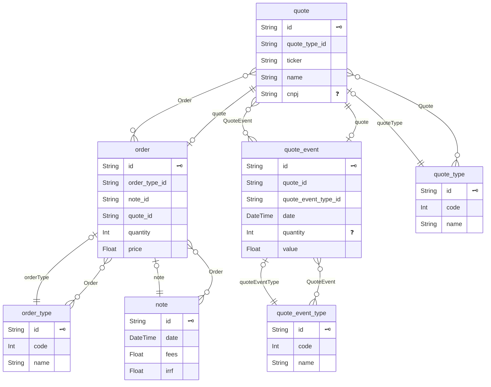

```mermaid
erDiagram

  "quote" {
    String id "🗝️"
    String quote_type_id 
    String ticker 
    String name 
    String cnpj "❓"
    }
  

  "note" {
    String id "🗝️"
    DateTime date 
    Float fees 
    Float irrf 
    }
  

  "order" {
    String id "🗝️"
    String order_type_id 
    String note_id 
    String quote_id 
    Int quantity 
    Float price 
    }
  

  "quote_event" {
    String id "🗝️"
    String quote_id 
    String quote_event_type_id 
    DateTime date 
    Int quantity "❓"
    Float value 
    }
  

  "order_type" {
    String id "🗝️"
    Int code 
    String name 
    }
  

  "quote_type" {
    String id "🗝️"
    Int code 
    String name 
    }
  

  "quote_event_type" {
    String id "🗝️"
    Int code 
    String name 
    }
  
    "quote" o|--|| "quote_type" : "quoteType"
    "quote" o{--}o "order" : "Order"
    "quote" o{--}o "quote_event" : "QuoteEvent"
    "note" o{--}o "order" : "Order"
    "order" o|--|| "order_type" : "orderType"
    "order" o|--|| "note" : "note"
    "order" o|--|| "quote" : "quote"
    "quote_event" o|--|| "quote" : "quote"
    "quote_event" o|--|| "quote_event_type" : "quoteEventType"
    "order_type" o{--}o "order" : "Order"
    "quote_type" o{--}o "quote" : "Quote"
    "quote_event_type" o{--}o "quote_event" : "QuoteEvent"
```
